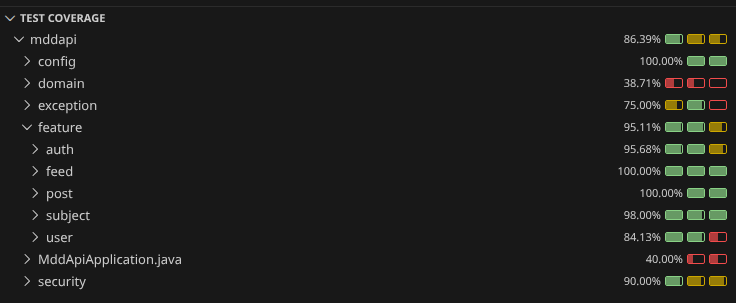

# P6 Full-Stack Reseau Dev

## Table of Contents
- [Overview](#overview)
- [Tech Stack](#tech-stack)
- [Project Structure](#project-structure)
- [Getting Started](#getting-started)
- [Frontend (Angular)](#frontend-angular)
  - [Development Server](#development-server)
  - [Build](#build)
  - [UI Library](#ui-library)
- [Backend (Spring Boot)](#backend-spring-boot)
  - [Environment (.env)](#environment-env)
  - [Development Server](#development-server-1)
  - [API Endpoints](#api-endpoints)
- [Security](#security)
- [FAQ (User Guide)](#faq-user-guide)
- [Testing](#testing)
  - [Test Commands](#test-commands)
  - [Test Results](#test-results)
  - [Backend Test Notes](#backend-test-notes)
  - [Cypress: `data-cy` Naming Conventions](#cypress-data-cy-naming-conventions)
    - [General Rules](#general-rules)
    - [Recommended Patterns](#recommended-patterns)
    - [Examples in This Project](#examples-in-this-project)
    - [When to Add a `data-cy`](#when-to-add-a-data-cy)

## Overview
A full-stack developer social network where users can register, log in, subscribe to subjects, and publish posts.The feed shows posts from the subjects a user follows, and each post supports comments.

## Tech Stack
- Frontend: Angular 21, TypeScript 5.9, Angular Material 21, RxJS 7.8
- Backend: Spring Boot 4.0.1, Java 21, Spring Security (JWT), Spring Data JPA
- Database: MySQL (runtime), H2 (tests)
- Tests: Cypress (E2E), Vitest (frontend), JUnit/Mockito (backend)

## Project Structure
- `front/`: Angular application
- `back/`: Spring Boot API
- `img/`: Readme screenshots

## Getting Started
Install dependencies in the frontend before running the app:

```bash
cd front
npm install
```

## Frontend (Angular)
Generated with [Angular CLI](https://github.com/angular/angular-cli) version 14.1.3.

### Development Server
Run the dev server:

```bash
cd front
ng serve
```

Then navigate to `http://localhost:4200/`. The application will automatically reload if you change any source files.

### Build
Build the project:

```bash
cd front
ng build
```

Build artifacts are stored in `front/dist/`.

### UI Library
The project uses `@angular/material`. You can keep it or replace it based on your preference.

## Backend (Spring Boot)
### Environment (.env)
The backend requires a `.env` file located at `back/.env` for the application to start.
It must contain the following variables:

```
DB_NAME=
DB_USER=
DB_PASSWORD=
JWT_SECRET=
```

The app will not boot without this file.

### Development Server
From the project root, load the backend environment variables and start Spring Boot:

```bash
set -a && source back/.env && set +a && mvn -f back/pom.xml spring-boot:run
```

### API Endpoints
| Method | Path | Auth | Description |
| --- | --- | --- | --- |
| POST | `/api/auth/register` | Public | Register a new user |
| POST | `/api/auth/login` | Public | Authenticate and issue access + refresh tokens |
| POST | `/api/auth/refresh` | Public | Rotate refresh token and issue a new access token |
| POST | `/api/auth/logout` | Public | Revoke refresh token and clear cookie |
| GET | `/api/users/me` | Required | Get current user profile |
| PUT | `/api/users/me` | Required | Update current user profile |
| GET | `/api/subjects` | Required | List subjects with subscription status |
| POST | `/api/subjects/{id}/subscribe` | Required | Subscribe to a subject |
| DELETE | `/api/subjects/{id}/subscribe` | Required | Unsubscribe from a subject |
| POST | `/api/posts` | Required | Create a post |
| GET | `/api/posts/{id}` | Required | Get post details (includes comments) |
| POST | `/api/posts/{id}/comments` | Required | Add a comment to a post |
| GET | `/api/feed` | Required | Get feed, sorted with `?sort=asc|desc` |

## Security
Authentication is based on JWT access tokens (short-lived) and refresh tokens stored in an HttpOnly cookie.
The access token is a signed HS256 JWT using the `JWT_SECRET` from `back/.env`.
Protected endpoints require a valid `Authorization: Bearer <token>` header; only `/api/auth/**` is public.

Key points:
- Access tokens are issued by the backend and validated by Spring Security (OAuth2 Resource Server).
- Refresh tokens are rotated and stored server-side as a hash; the raw token only lives in the HttpOnly cookie.
- Stateless session policy (no server session for access tokens).
- CORS is configured from `app.cors.allowed-origins` in `application.yml`.

Rules summary:
- Public: all `/api/auth/**` endpoints.
- Auth required: everything else under `/api/**`.
- Unauthorized responses return a JSON error payload with `UNAUTHORIZED`.

Endpoints summary:
- `POST /api/auth/register` and `POST /api/auth/login` are public.
- `POST /api/auth/refresh` uses the refresh cookie to rotate tokens.
- All other `/api/**` routes require authentication.

## FAQ (User Guide)
**How do I create an account?**  
Go to the Register screen, enter your email, username, and a valid password, then submit.

**I can’t log in. What should I check?**  
Make sure you are using the correct identifier (email or username) and password. Check for typos and case.

**Why am I redirected to the login page?**  
You are not authenticated (or your session expired). Log in again to access private pages.

**I can’t update my profile. Why?**  
You must change at least one field. Email and username must be unique.

**My feed is empty. Is that normal?**  
Yes, if you are not subscribed to any subject. Subscribe to topics to see content.

**I can’t create a post.**  
You must be logged in and select a subject. Title and content cannot be empty.

**I can’t add a comment.**  
You must be logged in and your comment cannot be empty.

## Testing

### Test Commands
Run tests from the `front/` directory:

```bash
# Cypress (E2E)
npm run cy:open
npm run cy:run

# Vitest (unit)
npm run test
npm run test:coverage
```

Backend (Spring Boot):

```bash
# Unit + controller tests (no coverage)
./mvnw -f back/pom.xml test
```

Coverage options for the backend:

```bash
# If JaCoCo is configured, this will also produce a coverage report in back/target/site/jacoco/
./mvnw -f back/pom.xml test
```

Tip: In VS Code, you can also use "Run Test With Coverage" from the Testing panel for the backend.

### Test Results
#### Cypress (E2E)


#### Vitest (Unit)


#### JUnit (Backend)


### Backend Test Notes
- The backend uses fast unit tests for services and lightweight controller tests.
- Controller tests rely on Spring Boot 4 testing patterns (`@MockitoBean`) and a test `MockMvc` configuration.


### Cypress: `data-cy` Naming Conventions
Goal: keep selectors stable and readable for E2E tests.

#### General Rules
- Use `data-cy` for elements targeted by Cypress.
- Prefer semantic names over CSS structure.
- Use lowercase, kebab-case names.
- Reuse an existing `data-cy` when possible.
- For lists, suffix with a stable id.
- Exception: for Angular Material `mat-select` options, prefer `cy.contains('mat-option', 'Label')`
  because options are rendered in an overlay.

#### Recommended Patterns
- Primary actions: `<area>-<action>`
  - Example: `login-submit`, `post-create-submit`
- Inputs: `<area>-<field>`
  - Example: `login-identifier`, `register-email`, `user-password`
- Links: `<area>-link-<target>`
  - Example: `header-link-user`
- States: `<area>-loading`, `<area>-empty`
- Cards/lists: `<area>-card-<id>`
  - Example: `feed-card-42`, `subject-card-10`
- Actions on list items: `<area>-<action>-<id>`
  - Example: `subject-subscribe-10`, `user-unsubscribe-10`

#### Examples in This Project
- Header: `header-burger`, `header-drawer`, `header-drawer-subjects`, `header-drawer-logout`
- Home: `home-login`, `home-register`
- Feed: `feed-loading`, `feed-empty`, `feed-card-link-<id>`
- Post create: `post-create-subject`, `post-create-submit` (select option via `mat-option` text)
- Post detail: `post-comment-content`, `post-comment-submit`

#### When to Add a `data-cy`
- The element is clicked or asserted in Cypress.
- The selector would otherwise depend on CSS classes or text.
