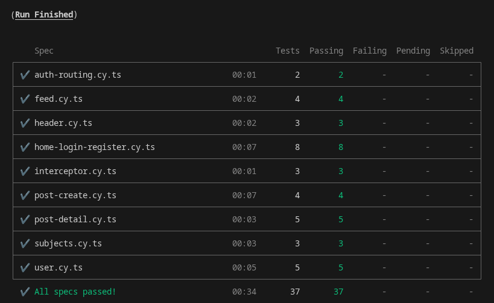
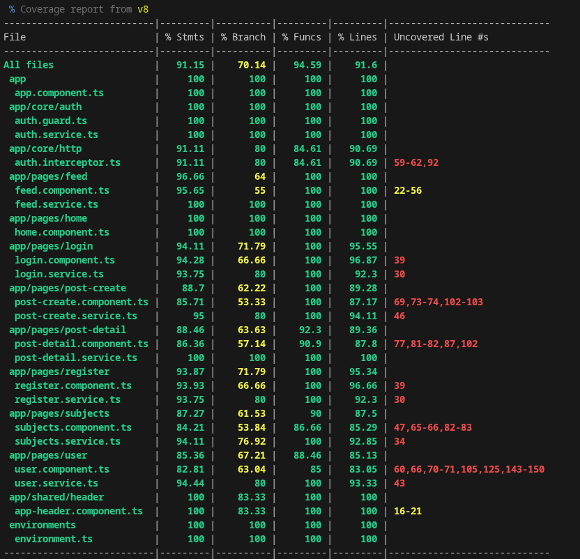

# P6 Full-Stack Reseau Dev

## Table of Contents
- [Overview](#overview)
- [Project Structure](#project-structure)
- [Getting Started](#getting-started)
- [Frontend (Angular)](#frontend-angular)
  - [Development Server](#development-server)
  - [Build](#build)
  - [UI Library](#ui-library)
- [Backend (Spring Boot)](#backend-spring-boot)
  - [Development Server](#development-server-1)
- [Testing](#testing)
  - [Test Commands](#test-commands)
  - [Test Results](#test-results)
  - [Cypress: `data-cy` Naming Conventions](#cypress-data-cy-naming-conventions)
    - [General Rules](#general-rules)
    - [Recommended Patterns](#recommended-patterns)
    - [Examples in This Project](#examples-in-this-project)
    - [When to Add a `data-cy`](#when-to-add-a-data-cy)

## Overview
A full-stack project with an Angular frontend and a Spring Boot backend.

## Project Structure
- `front/`: Angular application
- `back/`: Spring Boot API
- `img/`: Readme screenshots

## Getting Started
Install dependencies in the frontend before running the app:

```bash
cd front
npm install
```

## Frontend (Angular)
Generated with [Angular CLI](https://github.com/angular/angular-cli) version 14.1.3.

### Development Server
Run the dev server:

```bash
cd front
ng serve
```

Then navigate to `http://localhost:4200/`. The application will automatically reload if you change any source files.

### Build
Build the project:

```bash
cd front
ng build
```

Build artifacts are stored in `front/dist/`.

### UI Library
The project uses `@angular/material`. You can keep it or replace it based on your preference.

## Backend (Spring Boot)
### Development Server
From the project root, load the backend environment variables and start Spring Boot:

```bash
set -a && source back/.env && set +a && mvn -f back/pom.xml spring-boot:run
```

## Testing

### Test Commands
Run tests from the `front/` directory:

```bash
# Cypress (E2E)
npm run cy:open
npm run cy:run

# Vitest (unit)
npm run test
npm run test:coverage
```

### Test Results
#### Cypress (E2E)


#### Vitest (Unit)


### Cypress: `data-cy` Naming Conventions
Goal: keep selectors stable and readable for E2E tests.

#### General Rules
- Use `data-cy` for elements targeted by Cypress.
- Prefer semantic names over CSS structure.
- Use lowercase, kebab-case names.
- Reuse an existing `data-cy` when possible.
- For lists, suffix with a stable id.
- Exception: for Angular Material `mat-select` options, prefer `cy.contains('mat-option', 'Label')`
  because options are rendered in an overlay.

#### Recommended Patterns
- Primary actions: `<area>-<action>`
  - Example: `login-submit`, `post-create-submit`
- Inputs: `<area>-<field>`
  - Example: `login-identifier`, `register-email`, `user-password`
- Links: `<area>-link-<target>`
  - Example: `header-link-user`
- States: `<area>-loading`, `<area>-empty`
- Cards/lists: `<area>-card-<id>`
  - Example: `feed-card-42`, `subject-card-10`
- Actions on list items: `<area>-<action>-<id>`
  - Example: `subject-subscribe-10`, `user-unsubscribe-10`

#### Examples in This Project
- Header: `header-burger`, `header-drawer`, `header-drawer-subjects`, `header-drawer-logout`
- Home: `home-login`, `home-register`
- Feed: `feed-loading`, `feed-empty`, `feed-card-link-<id>`
- Post create: `post-create-subject`, `post-create-submit` (select option via `mat-option` text)
- Post detail: `post-comment-content`, `post-comment-submit`

#### When to Add a `data-cy`
- The element is clicked or asserted in Cypress.
- The selector would otherwise depend on CSS classes or text.
